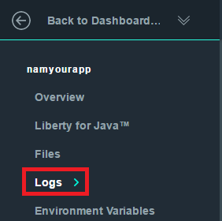
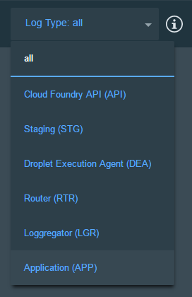

# Bot de conversação simples para o processo de formação da empresa FCamara

#### Desenvolvido por:

* [Gabriel Craveiro](https://github.com/gabrielcraveiro)
* [Mateus Vilione](https://github.com/mateusvilione)
* [Raquel Vilione](https://github.com/raquelvilione)

Essa aplicação simula utilizando o watson, uma conversa com um possível chat da empresa FCamara. 


Você pode conferir uma [demo](https://fcamaraformacao.mybluemix.net) app.

## Antes de você começar.

* Crie uma conta da Bluemix
    * [Registrar](https://console.ng.bluemix.net/registration/?target=/catalog/%3fcategory=watson) na Bluemix, ou você pode logar utilizando uma conta ja existente. Não se esqueça de conferir se você possui espaço para criação de novos apps.
* Tenha certeza que você possui os seguintes requisitos instalados:
    * O [Node.js](https://nodejs.org/#download) runtime, que já vem com o node package manager
    * E o terminal da [Cloud Foundry](https://www.cloudfoundry.org/)

      Nota: confira se sua versão está atualizada.

&nbsp;&nbsp;&nbsp;&nbsp;&nbsp;&nbsp;&nbsp;&nbsp;&nbsp;&nbsp;&nbsp;&nbsp;&nbsp;&nbsp;&nbsp;&nbsp;&nbsp;&nbsp;&nbsp;&nbsp;&nbsp;&nbsp;&nbsp;&nbsp;&nbsp;&nbsp;&nbsp;&nbsp;&nbsp;&nbsp;&nbsp;&nbsp;&nbsp;&nbsp;&nbsp;&nbsp;[](#bluemix)     &nbsp;&nbsp;&nbsp;&nbsp;&nbsp;&nbsp;&nbsp;&nbsp;&nbsp;&nbsp;&nbsp;&nbsp;&nbsp;&nbsp;&nbsp;&nbsp;&nbsp;&nbsp;&nbsp;&nbsp;&nbsp;&nbsp;&nbsp;&nbsp;[](#local)

## Como o app funciona

A interface do aplicativo foi treinada para servir como um exemplo de bot da empresa FCamara. A interface permite que o usuario digite um texto e receba uma resposta do bot. Na parte direita do programa é apresentada as informações de como o app recebe e identifica a informação.
Suas perguntas e comandos são executados com dados pré-treinados como por exemplo:

* `quais são os valores da fcamara`
* `ola`
* `culture code`

Essas intenções ajudam o programa a entender as variações de questões e comandos que você possa escrever. Porf exemplo, se você digitar Qual é o culture code da FCamara? o programa vai entender sua intenção.

# Começando com o bluemix


   
&nbsp;&nbsp;&nbsp;&nbsp;&nbsp;&nbsp;&nbsp;&nbsp;&nbsp;&nbsp;&nbsp;&nbsp;

## Fazendo o deploy.
1 Clique nesse botão para dar deploy no bluemix e aguarde.

&nbsp;&nbsp;&nbsp;&nbsp;&nbsp;&nbsp;&nbsp;&nbsp;&nbsp;&nbsp;&nbsp;&nbsp; [](https://bluemix.net/deploy?repository=https://github.com/gabrielcraveiro/chatbot-Fcamara)

2 Faça login com uma conta da bluemix.

3 Escolha sua organização, nome de toolchain, região e espaço e clique em Deploy.

&nbsp;&nbsp;&nbsp;&nbsp;&nbsp;&nbsp;&nbsp;&nbsp;&nbsp;&nbsp;&nbsp;&nbsp;

* Isso executa diversas ações:
  - Cria o app
  - Cria uma instancia do conversation service que você vai utilizar mais adiante

* O seu chatbot da fcamara esta pronto agora! clique em Delivery Pipeline para dar deploy!.

&nbsp;&nbsp;&nbsp;&nbsp;&nbsp;&nbsp;&nbsp;&nbsp;&nbsp;&nbsp;&nbsp;&nbsp;

5 Depois que o seu app estiver pronto vá para a sua bluemix dashboard e [import uma workspace](#workspace).

&nbsp;&nbsp;&nbsp;&nbsp;&nbsp;&nbsp;&nbsp;&nbsp;&nbsp;&nbsp;&nbsp;&nbsp;

## <a name="usingCloudfoundry"></a> Usando a Cloudfoundry CLI para fazer o deploy para a sua aplicação

Para dar build:

1 Download e instale o [Cloudfoundry CLI](https://github.com/cloudfoundry/cli).

2 Git clone o projeto `https://github.com/gabrielcraveiro/chatbot-Fcamara`

3 Va para a pagina do projeto

4 Conecte ao bluemix com o prompt de comando:

 ```sh

 $ cf api https://api.ng.bluemix.net

 ```

 ```sh

 $ cf login -u <your user ID> ou email

 ```

5 Cria o serviço de conversação no Bluemix:

 ```sh

 $ cf create-service conversation free conversation-service

 ```

6 Faça um push pra ficar ao vivo:

 ```sh

 $ cf push <application-name>

 ```
 O nome que você escolher determinará a url que ficará o programa. Exemplo: `<application-name>.mybluemix.net`.

# <a name="workspace"></a> Importe a workspace

1 Você precisa importar a workspace do nosso app. Para fazer isso vá até a dashboard do bluemix e selecione a instância de serviço de conexão (Conversation service instance). Depois selecione **Service Credentials**

&nbsp;&nbsp;&nbsp;&nbsp;&nbsp;&nbsp;&nbsp;&nbsp;&nbsp;&nbsp;&nbsp;&nbsp;

2 Selecione **ADD CREDENTIALS**. Dê um nome para a sua credencial e selecione **ADD**.

3 Volte para o **Manage** menu e selecione **Launch Tooling**. Isso vai abrir uma nova tab no seu browser onde ele vai pedir para você colocar suas credenciais da BlueMix.

4 Baixe o [exported JSON file](https://github.com/gabrielcraveiro/chatbot-Fcamara/blob/master/training/car-dashboard.json) que contém o conteúdo da workspace.

5 Selecione **Import**. Navegue até o arquivo JSON que você baixou e clique duas vezes. Escolha para importar **Everything(Intents, Entities, and Dialog)**. E então selecione **Import** para finalalizar a importação do workspace.

6 Dê um refresh no seu browser. Uma nova workspace vai ter sido criada em tooling. Selecione o botão de _menu_ dentro do quadrado do workspace, e então selecione **View details**:

&nbsp;&nbsp;&nbsp;&nbsp;&nbsp;&nbsp;&nbsp;&nbsp;&nbsp;&nbsp;&nbsp;&nbsp;

<a name="workspaceID">
Na interface de detalhes, copie os 36 caracteres de ID. Esse vai ser o **Workspace ID**.
</a>

&nbsp;&nbsp;&nbsp;&nbsp;&nbsp;&nbsp;&nbsp;&nbsp;&nbsp;&nbsp;&nbsp;&nbsp; 


7 Retorne para a sua aplicação, e [add environment variables](#env).

Se você precisar de mais informações acesse a [Conversation service documentation](https://console.bluemix.net/docs/services/conversation/configure-workspace.html#configuring-a-conversation-workspace).

# <a name="env"></a> Colocando a variavel de environment no BlueMix

1 No Bluemix, abra a aplicação da dashboard. Selecione **Runtime** no menu lateral esquerdo.

2 Selecione **ENVIRONMENT VARIABLES** e de role a tela até **USER-DEFINED**.

3 Selecione **ADD**.

4 Add uma variavel com o nome **WORKSPACE_ID**. Para o value, coloque a id do workspace que você [copiou antes](#workspaceID). Selecione **SAVE** para salvar.

&nbsp;&nbsp;&nbsp;&nbsp;&nbsp;&nbsp;&nbsp;&nbsp;&nbsp;&nbsp;&nbsp;&nbsp;

5 Recrie sua aplicação.


# Resolução de erros no Bluemix clássico

#### No app:
- Log in no Bluemix, você vai ser levado para a dashboard.
- Va até a aplicação que você criou antes.
- Selecione **Logs**.

&nbsp;&nbsp;&nbsp;&nbsp;&nbsp;&nbsp;&nbsp;&nbsp;&nbsp;&nbsp;&nbsp;&nbsp;

- Se você desejar, filtre o tipo de LOG por "APP"".

&nbsp;&nbsp;&nbsp;&nbsp;&nbsp;&nbsp;&nbsp;&nbsp;&nbsp;&nbsp;&nbsp;&nbsp;

#### No novo bluemix:
- Faça login no Bluemix, você vai ser levado para a dashboard.
- Selecione **Compute**

&nbsp;&nbsp;&nbsp;&nbsp;&nbsp;&nbsp;&nbsp;&nbsp;&nbsp;&nbsp;&nbsp;&nbsp;

- Selecione a aplicação que você criou anteriormente.
- Selecione **Logs**.

&nbsp;&nbsp;&nbsp;&nbsp;&nbsp;&nbsp;&nbsp;&nbsp;&nbsp;&nbsp;&nbsp;&nbsp;

- Se você desejar, filtre o tipo de LOG por "APP"".

&nbsp;&nbsp;&nbsp;&nbsp;&nbsp;&nbsp;&nbsp;&nbsp;&nbsp;&nbsp;&nbsp;&nbsp;

### Com CLI

```
$ cf logs < application-name > --recent
```

# README baseado nos seguintes tutoriais:

* https://github.com/watson-developer-cloud/car-dashboard
* https://www.ibm.com/blogs/watson/2016/12/build-chat-bot/
* https://medium.com/as-m%C3%A1quinas-que-pensam/criando-chat-bots-no-facebook-com-o-ibm-watson-parte-2-a-integra%C3%A7%C3%A3o-c12ba2af7e8a

# License

  This sample code is licensed under Apache 2.0.
  Full license text is available in [LICENSE](LICENSE).

# Contributing

  See [CONTRIBUTING](CONTRIBUTING.md).


## Open Source @ IBM

  Find more open source projects on the
  [IBM Github Page](http://ibm.github.io/).
